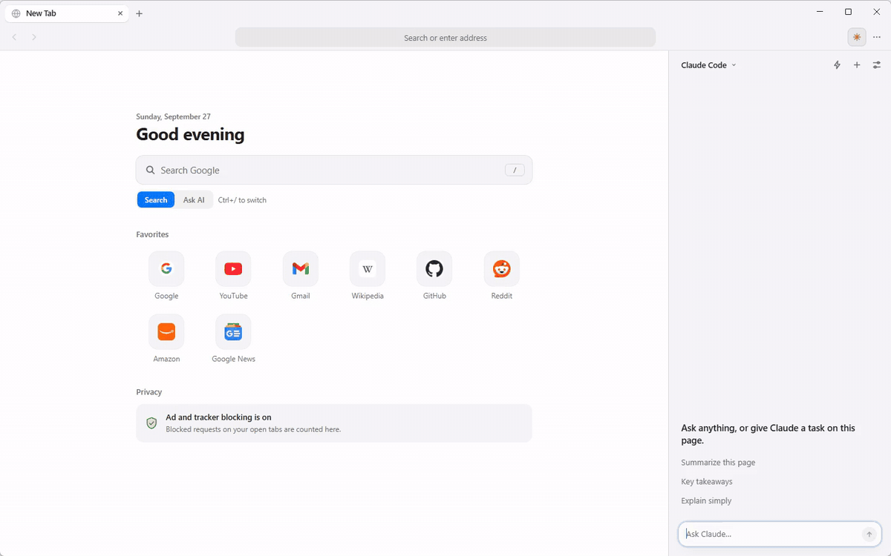
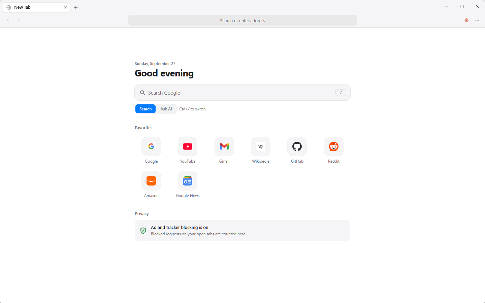
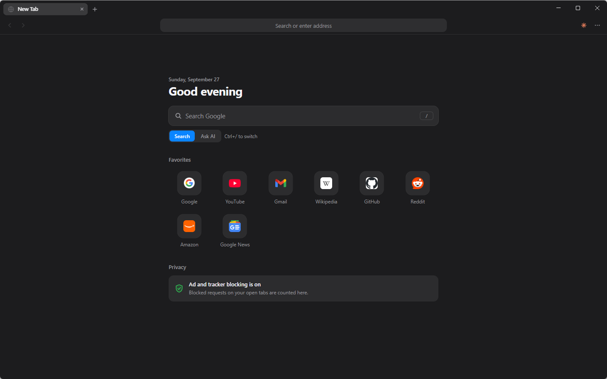
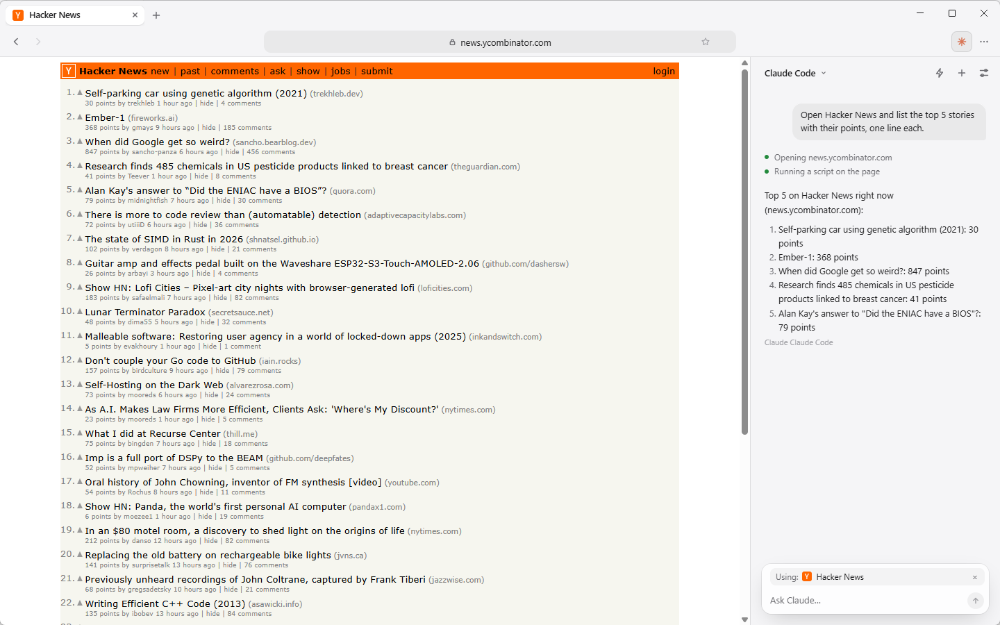
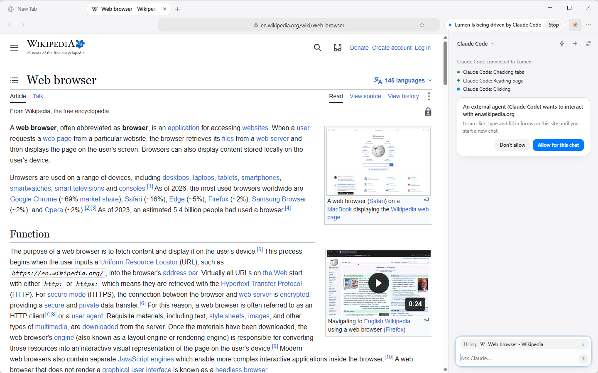
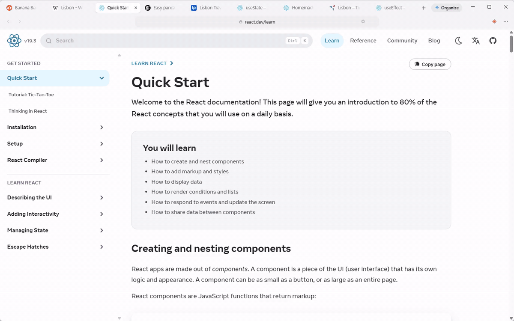
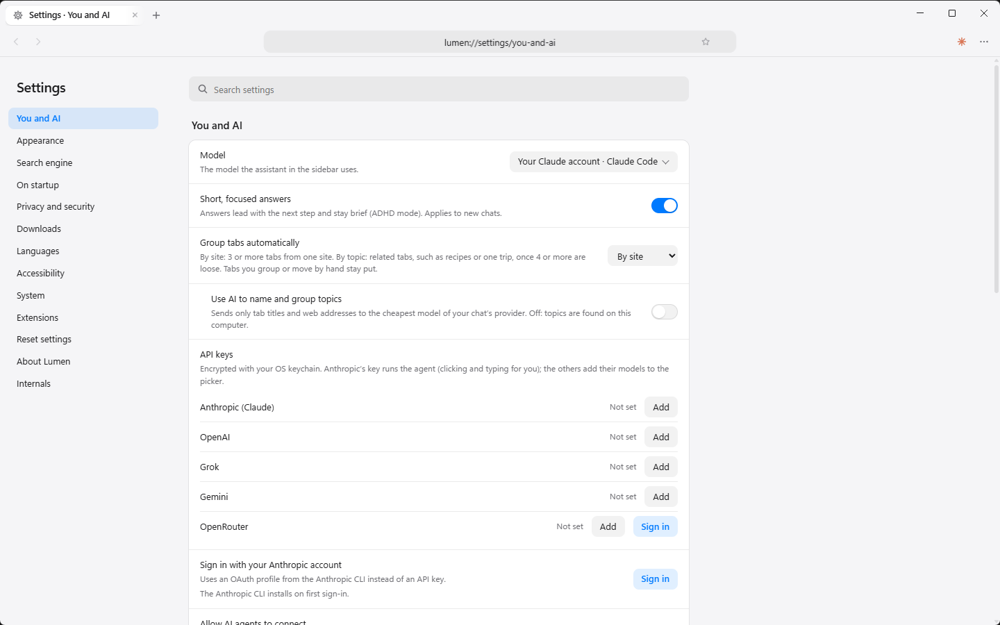

# Lumen

**Every AI, one browser.** Lumen is a fast, calm Chromium browser with an AI built into the sidebar. Bring the one you like: **Claude (with your own Claude account through Claude Code), ChatGPT, Gemini, Grok, or any model on OpenRouter**. Switch between them mid-conversation, or let **any AI agent drive it over MCP**.



<sub>A real, unedited run (about 18 seconds) of "Claude · your account (Claude Code)" with a Claude Code login. The capture profile auto-allows actions, so the approval card you'd normally see before the AI first acts on a site isn't shown. [MP4 version](docs/media/agent-task.mp4).</sub>

- **An AI that does things, not just chats.** It reads the page you're on and acts on it: clicks, types, fills in forms, opens and groups tabs, and researches several pages at once. It asks before acting on a new site, and a form that doesn't fill completely is never submitted.
- **Your choice of model.** Claude (Opus, Sonnet, Haiku, Fable), OpenAI, Grok, Gemini and OpenRouter. Use your Claude account through Claude Code, add a key, sign in to Anthropic with its CLI, or sign in with OpenRouter. The toolbar button takes on each company's mark.
- **A real browser underneath.** Tabs that group themselves by site or by topic, a bookmarks menu, a searchable history page, a downloads menu (with a list in Settings), find, zoom, Chrome Web Store extensions, a built-in ad and tracker blocker, and import from Chrome, Edge, Brave, Vivaldi, Opera or Firefox.
- **Private by default.** No telemetry. Background reading and search run without your cookies, the scripts the AI uses to read pages run where sites can't see them, the current chat is encrypted at rest, and the start page makes no network requests.
- **Calm to look at.** Light and dark themes that follow your system, and spring animations.

## Install

Download the latest build from [Releases](https://github.com/emah-maker/lumen/releases).

| Computer | File |
|---|---|
| Windows 10/11 (x64) | `Lumen-Setup-<version>.exe` (installer) or `Lumen-<version>-win-x64.zip` (unzip and run `Lumen.exe`) |
| Mac with Apple silicon (M1 and later) | `Lumen-<version>-mac-arm64.dmg` |
| Mac with Intel | `Lumen-<version>-mac-x64.dmg` |

**Windows:** the builds aren't code-signed. SmartScreen may say "Windows protected your PC": choose **More info → Run anyway**. On PCs with Smart App Control turned on, the zip is the one that runs. Its `Lumen.exe` is the untouched Electron binary, which Windows recognises, while a freshly built installer isn't. Or build and install locally (below).

**Mac:** the app is ad-hoc signed, not signed with an Apple Developer ID, so the first launch is blocked. Right-click **Lumen** in Applications and choose **Open**, then **Open** again. If macOS says the app "is damaged", run:

```
xattr -dr com.apple.quarantine /Applications/Lumen.app
```

**Updates:** Lumen looks for a new release shortly after it starts and every few hours (**Settings → About Lumen → Updates** shows the result and has **Check for updates**). Every copy that can write to the folder it is installed in (the setup's per-user install, the zip, a hand-copied folder, the Mac app in Applications) updates itself the same way: it downloads the release's zip in the background ("Downloading Lumen vX…"), checks it, unpacks it next to the install, and shows **Restart to update** in the toolbar. On restart the old folder is swapped for the new one and Lumen reopens with your tabs; your settings, chats and shortcuts are not touched, and if the swap can't happen Lumen keeps the old version and says why in Settings. Turn off **Download updates automatically** to be asked first. Copies that can't replace themselves (a per-machine install under Program Files, a Mac app in a folder you can't write to, the portable exe) show **Lumen vX is available** with a **Download** button for the zip, the dmg or the releases page instead. Downloads are checked against the SHA-512 hash in the release's `latest.yml` / `latest-mac.yml`; the builds aren't code-signed, so an update is only as trustworthy as the GitHub release it comes from. Lumen 0.2.4 and earlier have no updater: download a newer version by hand once.

On first launch the sidebar opens on a short welcome (run from source, **Make default** registers the development `electron` binary: use an installed build for that step): connect an AI, bring your bookmarks and history from another browser, and make Lumen your default browser (each step can wait; **Start browsing** closes it). A question typed before any AI is connected is kept and sent once one is.

Set up an AI any time from the sidebar's empty state or **Settings → AI and agents** (`Ctrl+,`; the sidebar's gear opens it): your Claude account through Claude Code, an Anthropic, OpenAI, Grok, Gemini or OpenRouter key (stored encrypted with the OS keychain), or **Sign in with OpenRouter**. `ANTHROPIC_API_KEY`, `OPENAI_API_KEY`, `XAI_API_KEY`, `GEMINI_API_KEY` and `OPENROUTER_API_KEY` work too.

## The start page

<p>
  
  
</p>

Widgets sit around the search box: weather, a world clock, your calendar, tasks, mail, headlines, markets, a TradingView chart or watchlist, notes, a countdown, a Pomodoro timer and your own custom cards. Add, move, resize and edit them right on the page (**Edit layout**), and make them solid, frosted or clear.

Search or ask the AI from the same box (**Search | Ask AI**, `Ctrl+/` and `Alt+A` switch; the choice belongs to that box only and never changes what the address bar does; each question starts a new chat in the sidebar), with your favorites and most-visited sites underneath. It's a local page with a strict Content Security Policy: it loads nothing from the network, and site icons come from a small local cache.

## The AI in the sidebar



`Ctrl+J` opens it. The AI reads the page and operates the browser.

- **Low-level actions:** click, type, keys and shortcuts, scroll, hover, click at a point on a screenshot, tabs, back/forward/reload.
- **High-level actions:**
  - click by visible text
  - `fill_form` fills a whole form by field labels
  - `read_urls` reads up to 6 pages in parallel in hidden tabs
  - `read_pdf` reads the text of a PDF open in a tab, only after you allow that PDF (a card, "Allow the AI to read <file name>?", remembered for that chat; local and web PDFs alike; up to 30,000 characters per call, page markers, page ranges, and a `query` that returns the pages where some text appears). The text counts as page content, like `read_page`. Scanned pages have no text.
  - `read_tabs` reads the text of several open tabs of the window in one call, without switching to them (6,000 characters per tab, 40,000 in all)
  - **Ask across open tabs:** type `@` in the composer to pick tabs (or `@all tabs`, `@this tab`); their text goes with that message, labelled `[Tab: title — host]`, and the message shows which tabs were attached. Sleeping tabs are sent by address only.
  - `run_script` runs JavaScript in the page for bulk extraction or edits
  - `wait_for` waits for text to appear
  - web search
- **The page you're on goes with your message.** Whichever AI answers (Claude by key or CLI sign-in, Claude Code, OpenAI, Grok, Gemini, OpenRouter), each message includes the current tab's title, address and first ~7,000 characters of readable text (not for new-tab or internal pages), marked as untrusted page content. The chip above the message box shows **Using: <page>**; click **×** to stop sending the page (remembered), **Include** to turn it back on.
- **ADHD mode** (on by default, toggle in Settings → AI and agents): answers lead with the next action, use short numbered steps, and end with one small next step.
- **Other AI models:** add an OpenAI, Grok (xAI), Gemini or OpenRouter key in Settings → AI and agents. Their models appear in the model menu, work with every browser tool, and can take over a chat mid-conversation.
- **OpenRouter:** paste a key or **Sign in with OpenRouter** (OAuth with PKCE through a one-time local address; the key it returns is stored like a pasted one). The menu shows the newest Claude, GPT, Gemini, Llama, DeepSeek and Grok models; **More models…** searches all of them (the list is cached for a day). Models that can't use tools are marked **(chat only)**: they read the page with you but can't click or type in your tabs.

### Asking before it acts



- **New sites.** The first time the AI clicks, types, hovers, presses keys or runs a script on a site in a chat, a card asks you to allow it. The bolt in the sidebar head (**Auto-allow actions**) skips these cards for the sidebar's own AI; agents connected over MCP always ask.
- **Leaving with what it read.** Once the AI has read content in a chat (`read_page`, `find`, `screenshot`, `run_script`, `read_urls`, `list_tabs`, `batch`, `read_pdf`, `read_tabs`, or the page text Lumen sends with your message), navigating to, opening or fetching a site not yet approved in that chat shows a card ("Claude wants to open <host>"), one per new site. Approving adds the site to the chat's approved sites. This lasts for the whole chat and resets on **New chat**; a chat restored after a restart counts as having read content. Approved sites, and everything while Auto-allow is on, skip the card; MCP agents are always asked. This is so a page can't quietly tell the AI to carry what it read off to another site. The same card appears when an approved site redirects to a new one, and before the AI's `web_search` sends its query to DuckDuckGo (the card shows the query).
- **Your signed-in accounts.** `read_urls` reads pages signed out. When the AI needs your own account page (your grades, your orders) it can ask with `as_user`: a card "Let the AI use your signed-in <site> account?" offers **No** (the default), **Just this once** or **Always for <site>**. Allowed, the page opens in a background tab of your own session, grouped "AI: <site> (signed in)", is read, and closes when the reply is done unless you switched to it. It is per host, read only (clicking or typing there still asks as above), and a redirect to any other host is read signed out instead. Banks, payment services, password managers and account-security pages are only ever **Just this once**. The sites you allowed always are listed, with Remove and Remove all, in Settings → AI and agents → **Signed-in sites the AI can use**. Auto-allow doesn't cover this card, and agents connected over MCP (and background tasks) always read signed out. The AI's own tab actions (`navigate`, `open_tab`) work in your tabs as before, signed in.
- **What it can see of your tabs.** `list_tabs` shows the AI only web pages and blank new tabs, with query strings and `#fragments` removed; internal pages (settings, history) and `file://` tabs are left out, and `switch_tab` can only go to the tabs it lists.
- **Only web pages.** The AI can only open http and https addresses.
- **Sensitive steps.** The AI is instructed to stop and ask before purchases, payments, sending messages, posting, deleting data, changing account settings, or submitting personal information, and never to type passwords, card numbers or one-time codes. These are instructions to the model, not hard blocks. What Lumen enforces itself: the values of password fields are never included when the AI reads a page, and `fill_form` does not submit a form when any field failed to fill.
- **Saved passwords (off by default).** Settings → Privacy and security → **Save passwords** offers to save a sign-in on https sites and fills it when you click the key in the address field; Lumen never fills or submits by itself. They're encrypted with your OS keychain. The AI and outside agents have no way to read them: after you fill one, `run_script` is refused on that site in that tab, and fills are refused while a CDP client is connected.
- **Page content is untrusted.** Page text, search results and screenshots reach the model marked as data, not instructions.

## Your own Claude account, through Claude Code

If [Claude Code](https://claude.com/claude-code) is installed, the model menu starts with a **Your Claude account** group: **Claude · your account (Claude Code)**. Each message runs your own `claude` CLI headless, signed in with your own login (including a school or work plan), and it drives Lumen through Lumen's MCP server:

- Lumen never sees your claude.ai credentials; the CLI keeps its own login. Not signed in? Run `claude` once in a terminal and type `/login`.
- The CLI only gets Lumen's browser tools (no shell, no file edits), and Lumen's approval cards still apply. Follow-ups continue the same Claude Code session; **New chat** starts a fresh one. **Stop** ends the CLI and everything it started.
- **Claude Code** uses the model set in Claude Code; **Claude Code · Fable / Opus / Sonnet / Haiku** pass `--model` with that alias. Switching between them mid-chat keeps the same session. (Grok Build, when offered, lists the models `grok models` reports the same way; switching its model starts a new Grok session that is handed the conversation so far.)
- Uses your Claude Code login. For personal use; apps offered to others need Anthropic's approval to use claude.ai logins.

## Tabs that organize themselves



⋯ → Tab Groups → Group Automatically **Off / By Site / By Topic**. By topic finds related tabs (recipes, one trip, a library's docs) on your computer from titles and addresses. Turn on **Use AI to name and group topics** in Settings to send tab titles and site names (hostnames only) to the cheapest model of your chat's provider instead. **Organize Tabs by Topic** (tab menu or ⋯ → Tab Groups) regroups on demand, with **Undo Organize**. Groups you made and tabs you moved by hand are left alone.

## A real browser underneath



- **PDFs** open in Chromium's own viewer, from the web or from disk.
- **Make it yours** (Settings → Appearance): an accent color (nine presets or any color) across Lumen and its pages, and a new-tab page with a background (Plain, Aurora, Dusk, Ocean, Forest, Sunset, Graphite, or your own picture, kept in your profile), a big clock, a greeting with your name, and the sections you want. Open new-tab pages change as you pick.
- **New-tab widgets** (Settings → Appearance → Widgets): cards under the search box for the weather in a city you type (Open-Meteo, no account, °F or °C), your calendar from any ICS / webcal link (Muse, Google Calendar, Outlook, iCloud: today and upcoming events, with repeating and all-day events), your Todoist tasks due today or overdue (tick one off right on the card), what is playing on Spotify (with play, pause, next and previous; you supply your own Spotify Client ID and sign in from Settings), your Gmail unread count and latest messages (read-only; one-click "Sign in with Google" in builds with Lumen's Google client, or your own Google Cloud OAuth client), Slack unread DMs, mentions and recent channel messages (read-only, through your own Slack app), your GitHub review requests, assigned issues and pull requests and unread notification count (a read-only token), news headlines from any RSS or Atom feed, a world clock with sunrise and sunset, stock and crypto prices with a simulated paper portfolio (Lumen never places an order), a saved prompt answered by Meta’s Muse model, a live TradingView chart for any symbol (TradingView’s own chart in a frame, no account or key), a note that saves as you type, a countdown to a date, a timer or Pomodoro (focus, then a break; it keeps running while the page is closed), a **custom widget** built from a short JSON recipe (any https address that answers JSON, shown as numbers or a list; see [Custom widgets](docs/custom-widgets.md)), or any https page in a frame (a Muse board, a dashboard). Sites that refuse to be framed get an Open button instead, and Settings tells you which. Lumen fetches everything itself, so the new-tab page never goes online, and your Todoist token and your Spotify, Gmail, Slack and GitHub sign-ins are stored encrypted and never reach the page. Framed pages (the Web page and TradingView cards) load from their own site, like any tab. New kinds of widget are one entry in `features/widgets.js`.
  - **TradingView watchlist:** set a TradingView widget's Style to **Watchlist** for rows of symbols with logo, price and change, one tab per section (like TradingView's phone home-screen widget), optionally with a chart on top. Type or paste symbols (TradingView's “Export list” .txt works, `###Name` starts a section), or press **Import from TradingView** to pick one of your own watchlists: Lumen reads it with your TradingView sign-in in Lumen and, with **Keep in sync** on, re-reads it every 15 minutes. Indices TradingView won't price in widgets (SPX, NDQ, DJI, VIX, DXY) are shown through their CFD twins; futures stay blank.
  - **Add and edit on the page:** Notes, Countdown, Timer, TradingView, Custom and Web page widgets can be added from the page's **Add widget** menu and changed with the pencil on the card (or the gear in Edit layout), without opening Settings. Widgets with an account or a key are still set up in Settings, so keys never pass through the new-tab page.
  - **Saved as you go:** editing a widget in Settings saves by itself a moment after each change. If a change can't be saved (a missing date, a bad symbol) Settings says why, and leaving the form or closing the tab asks first.
  - **See-through cards:** **Settings → Appearance → Widget cards** is Solid, Frosted glass or Clear (as transparent as possible while the text stays readable, best on a gradient or your own picture).
- **Usage** (Settings → Usage, and a meter under the sidebar's composer while a Claude Code model is picked): your Claude plan's 5-hour and weekly limits with reset times, read with the free `claude /usage` and live from each turn, and how much of them Lumen uses: tokens per engine (Claude Code, Grok Build, API key) and roughly how far each Claude Code turn moved the 5-hour meter. Claude Code driving Lumen over MCP shows as its share of this computer's Claude Code use.
- **Downloads panel** (the toolbar's download button): progress with speed and time left, pause, resume, cancel, retry, show in folder, remove. Drag a finished file out of the panel into Finder, Explorer, mail or chat. The list is kept across restarts.
- **Ad blocker** built into the browser, not an extension. It uses uBlock Origin–compatible lists (Ghostery engine). Toggle it, or allow ads on one site, from **⋯ → Ad Blocker**. Hidden-element rules are applied in a way pages can't read, and uBlock's scripts disarm known anti-adblock checks. Blocked requests are cancelled, so a determined site can still notice that its ad request failed.
- **Chrome extensions** from the Chrome Web Store: open **⋯ → Extensions → Get Extensions…** and click *Add to Lumen*. Extension buttons appear in the toolbar. The ad blocker takes over Electron's request hooks, so extensions that block requests through the old `chrome.webRequest` API (Manifest V2) can't block. Manifest V3 extensions work; content blockers that rely on static declarativeNetRequest rulesets are refused at install.
- **Search engine:** Google, DuckDuckGo, Bing, Brave Search, Ecosia or Startpage (Settings, or ⋯ → Search Engine).
- **Import:** bookmarks and history from Chrome, Edge, Brave, Vivaldi, Opera or Firefox (Settings, or ⋯ → Import Bookmarks and History). Passwords and cookies are never read.
- **Permissions:** sites must ask before using your camera, microphone, location, or notifications.
- **Safe Browsing (optional, off by default):** with your own Google API key (Settings → Privacy), pages listed by Google Safe Browsing as suspected phishing or malware show a warning instead of loading. Pages are checked against lists kept on your computer; Google only ever sees partial hashes. Only you can choose to visit a flagged page; the AI can't. Like any list, it can miss unsafe sites and flag safe ones by mistake.

## Keyboard shortcuts

`Ctrl` is `Cmd` on macOS.

| Action | How |
|---|---|
| Open or close the AI sidebar | `Ctrl+J` or the toolbar's AI button |
| New chat in the sidebar (opens it if closed) | `Ctrl+Shift+K` |
| Ask the AI from the address bar | type, then `Alt+Enter` |
| New tab / close tab / focus address | `Ctrl+T` / `Ctrl+W` / `Ctrl+L` |
| Switch tabs | `Ctrl+Tab`, `Ctrl+Shift+Tab`, `Ctrl+1`–`9` |
| Reopen closed tab | `Ctrl+Shift+T` |
| Open a local file (HTML, PDF, images, media) | `Ctrl+O`, drop it on the window, type or paste its path, or **Open With → Lumen** |
| Back / forward | `Alt+←` / `Alt+→` (macOS: `Cmd+[` / `Cmd+]`) |
| Reload | `Ctrl+R` or `F5` |
| Find in page | `Ctrl+F` |
| Zoom | `Ctrl+=` / `Ctrl+-` / `Ctrl+0` |
| Bookmark this page | `Ctrl+D` |
| History | `Ctrl+H` (macOS: `Cmd+Y`) |
| Settings | `Ctrl+,` |
| Print | `Ctrl+P` |
| Full screen | `F11` (Windows, Linux) |
| Ask the AI about selected text | right-click → Ask Claude About Selection |
| Tab devtools | `F12` |

## Use Lumen from Claude Code, Codex, Gemini CLI

Lumen is an MCP server: any MCP-capable agent can drive the browser with the same tools the sidebar uses (read_page, click by text, fill_form, navigate, tabs, screenshot, read_urls, run_script, web_search, group_tabs…; all 28 with their parameters are in the [MCP tool reference](docs/mcp-tools.md)). It's off until you turn on **Settings → AI and agents → Allow AI agents to connect**. The exact commands for your install, with the right paths, are under **Connect an AI agent** in the same place (each with a Copy button). Claude Code, Codex CLI, Gemini CLI and Grok Build also get a one-click **Add to …** button, which turns the setting on (Claude Code's says **Already connected** if `claude mcp get lumen` finds it). They run Lumen's own executable in Node mode on `mcp.js`:

```powershell
# Claude Code on Windows (PowerShell or cmd). Use claude.cmd: in PowerShell the npm claude.ps1
# shim swallows the "--", and the command fails with "missing required argument 'commandOrUrl'".
claude.cmd mcp add lumen --scope user -e ELECTRON_RUN_AS_NODE=1 -- "C:\Users\<you>\AppData\Local\Programs\Lumen\Lumen.exe" "C:\Users\<you>\AppData\Local\Programs\Lumen\resources\app\mcp.js"
```

```sh
# Claude Code on macOS / Linux
claude mcp add lumen --scope user -e ELECTRON_RUN_AS_NODE=1 -- /Applications/Lumen.app/Contents/MacOS/Lumen /Applications/Lumen.app/Contents/Resources/app/mcp.js
```

```toml
# Codex CLI: ~/.codex/config.toml
[mcp_servers.lumen]
command = 'C:\Users\<you>\AppData\Local\Programs\Lumen\Lumen.exe'
args = ['C:\Users\<you>\AppData\Local\Programs\Lumen\resources\app\mcp.js']
env = { ELECTRON_RUN_AS_NODE = "1" }
```

```json
// Gemini CLI (~/.gemini/settings.json), Cursor, Claude Desktop and other MCP clients
{ "mcpServers": { "lumen": {
  "command": "C:\\Users\\<you>\\AppData\\Local\\Programs\\Lumen\\Lumen.exe",
  "args": ["C:\\Users\\<you>\\AppData\\Local\\Programs\\Lumen\\resources\\app\\mcp.js"],
  "env": { "ELECTRON_RUN_AS_NODE": "1" } } } }
```

How it works and what keeps it safe:

- The agent starts a small bridge that connects to the running Lumen over a per-user local channel (a named pipe on Windows, a Unix socket elsewhere) and proves it can read the random token in Lumen's profile folder (HMAC challenge-response; the token itself never crosses the channel). If Lumen isn't open, the bridge starts it.
- Every new site still needs your OK: an approval card appears in the sidebar ("An external agent (Claude Code) wants to interact with example.com"). Auto-allow doesn't apply to outside agents.
- While an agent is connected, the toolbar says **Lumen is being driven by …**, each tool call shows as a step in the sidebar, and **Stop** disconnects it.
- `Lumen --mcp` also works as the command, but on Windows GUI-mode Electron prints one blank line on stdout first, which strict clients may log as a parse error; the Node-mode command above avoids that.

## Drive Lumen with Playwright (Chrome DevTools Protocol)

Off by default. Turn on **Settings → Advanced → Automation → Allow automation tools (Chrome DevTools Protocol)**, pick a port (default 9222) and restart Lumen. Then click **Copy address**: the address includes a secret key (`http://127.0.0.1:9222/<token>`), and the port refuses requests without it.

```sh
# Playwright MCP, from Claude Code
claude mcp add playwright-lumen -- npx @playwright/mcp@latest --cdp-endpoint http://127.0.0.1:9222/<token>
```

```js
// Playwright
const browser = await chromium.connectOverCDP('http://127.0.0.1:9222/<token>');
const page = browser.contexts()[0].pages()[0]; // your open tabs
const tab = await browser.contexts()[0].newPage(); // opens a real Lumen tab
```

- Lumen listens on 127.0.0.1 only, through a proxy (`automation.js`) that shows only your tabs: Lumen's own UI, hidden reader tabs and extension pages can't be seen or attached to.
- `newPage()` opens a Lumen tab, `page.close()` closes it, and `browser.close()` only disconnects.
- The toolbar says **Lumen is being driven by Playwright (CDP)** while connected; **Stop** disconnects.
- CDP clients don't get approval cards. Any program on your computer that has the address can use the port while it's on, including on signed-in sites. Turning the setting off closes the proxy immediately.
- The proxy is the only way in, and no debugging port is ever opened. On Windows and Linux, Lumen starts through a small launcher (`launcher.js`) that gives Chromium a private pipe. On macOS there is no launcher (it would lose links opened from other apps): `cdp-inproc.js` answers the protocol inside Lumen from each tab's own debugger.
- Through the macOS (in-process) backend, some browser-level features aren't available and answer with an error: `browser.newContext()`, `context.grantPermissions()`, download events and blocking downloads, window bounds. Clients share one debugger session per tab, so Fetch interception (`page.route`) works for one client at a time, and an iframe or worker that starts paused may already be running when a client resumes it.

## Token-efficient tools (all AIs)

The sidebar agent, MCP clients and OpenAI/Grok/Gemini get the same cheaper tools:

| Tool | What it returns |
|---|---|
| `read_page` with `mode: "compact"` | an outline with `[id]` refs (headings, landmarks, text with inline links, controls with values) instead of JSON plus raw text. `mode: "full"` (the default) is unchanged. |
| `read_page` with `since_last: true` | only what changed since the last read |
| `find` | matching controls and short text snippets, instead of reading the page |
| `batch` | several actions (type, click, select, press, wait_for, scroll, hover) in one call, ending with what changed |
| `read_page` with `extract: "tables" | "links" | "lists"` (and `selector`) | that data as JSON, so `run_script` is not needed to pull a table |
| `navigate` / `open_tab` with `read: true` (and `wait_for: "text"`) | the new page's outline in the same call, instead of a separate `read_page` |
| `click`, `click_at`, `type_text`, `press_key` with `observe: true` | the action's result plus what changed on the page, instead of a follow-up read or screenshot |
| `screenshot` | 1024 px JPEG by default, with `max_width`, `quality` and `region` crop |

What one call costs on real pages (tokens ≈ characters / 4, measured with Lumen's own tools):

| Page | `read_page` (full, default) | `mode: "compact"` | `since_last` (unchanged page) | `find` (one word) |
|---|---|---|---|---|
| Wikipedia: WebKit | ~6,800 | ~1,500 | ~21 | ~180 |
| DuckDuckGo results | ~2,700 | ~760 | ~21 | ~360 |
| Long article: World War II | ~7,600 | ~1,500 | ~21 | ~180 |

Compact is about 4–5× smaller than a full read. The big savings come from not reading again: `since_last` after an action, `find` for one thing, and `batch` for several steps in one call. `node test/measure.js` runs whole tasks both ways.

## Privacy and security

- **No telemetry, no analytics, no crash reports.** Lumen has no servers of its own. What leaves your computer, and to whom: [PRIVACY.md](PRIVACY.md).
- **Keys and the chat** are encrypted with the OS keychain. Lumen keeps one chat; **New chat** replaces it. Without a keychain, keys aren't saved (use the environment variables) and the chat isn't kept between sessions.
- **Background reading and web search** run in a separate in-memory session with none of your cookies or logins. That session denies every permission request and cancels downloads.
- **Lumen's own UI is locked down.** The browser UI, the address-bar suggestions and the dialog overlay can't be navigated away or open popups (links open as tabs), web pages in tabs can't send the UI's privileged messages, and a link dropped on the window opens as a tab.
- **Approvals** for the AI and for MCP agents are described in [Asking before it acts](#asking-before-it-acts).
- Found a vulnerability? See [SECURITY.md](SECURITY.md).

## Build from source

```
npm install
npm start             # run from source
npm test              # the core Playwright suites, one at a time, with a pass/fail summary
npm test -- tabstrip  # just the named suites
```

### Build and install locally

```
npm run dist          # this computer's platform (Windows or macOS); or dist:win / dist:mac
npm run install_app   # Windows: installs to %LOCALAPPDATA%\Programs\Lumen with Desktop + Start menu shortcuts
```

Builds go to a local folder that isn't synced, even when the project itself lives in OneDrive:

- Windows: `%LOCALAPPDATA%\Lumen\build`
- macOS: `~/Library/Caches/Lumen/build`

Set `LUMEN_BUILD_DIR` to use a different folder. The installed Windows app lives on the local drive at `%LOCALAPPDATA%\Programs\Lumen`.

Set `LUMEN_GOOGLE_CLIENT_ID` and `LUMEN_GOOGLE_CLIENT_SECRET` (a Google Cloud OAuth client of type Desktop app, with the Gmail API enabled) when building to include Lumen's own Google client, which gives the Gmail widget a one-click "Sign in with Google". The same variables work when running from source. Without them the Gmail widget asks for the user's own Google Cloud client, as before. The release workflow reads them from repository secrets of the same names.

The Windows build ships the official Electron `.exe` byte for byte (`signAndEditExecutable: false`, `asar: false`, and Electron taken from node_modules), and `scripts/build.js` checks this after every build. Windows 11 Smart App Control blocks unsigned executables it doesn't recognise, and editing the exe (icon, version info, asar integrity) produces one. The untouched Electron binary is recognised, so it runs. The window, taskbar and shortcuts use Lumen's icon at runtime. For a normal signed installer, sign the build with a trusted code-signing certificate.

Release installers are built by GitHub Actions (`.github/workflows/release.yml`) and attached to [Releases](https://github.com/emah-maker/lumen/releases) when a version tag (`v*`) is pushed. Manual runs of the workflow keep the builds as run artifacts instead. To ship an update: bump `version` in package.json (`npm version patch --no-git-tag-version`), commit and push, then tag that commit with the same version and push the tag (`git tag v0.2.5 && git push origin v0.2.5`). The workflow refuses a tag that doesn't match package.json. Next to the installers the release gets `latest.yml`, `latest-mac.yml` and `.blockmap` files, which installed copies read to find and verify the update (`features/updates.js`; the Windows zip is listed in `latest.yml` by `scripts/add-zip-to-latest.js`; the updater is electron-updater).

### DRM (Widevine)

`electron` is castlabs' [ECS build](https://github.com/castlabs/electron-releases) (`electron-releases#v44.1.0+wvcus`), which adds a Widevine CDM that stock Electron doesn't have. On startup Lumen calls `components.whenReady()` (with a 10s timeout so a failed/offline CDM download never blocks the window opening) and logs `components.status()`; the CDM itself downloads on first run.

That's enough for sites that accept the plain Widevine CDM. Production DRM providers (Netflix, Disney+, Spotify and others) also check that the binary is **VMP-signed** by castlabs. An unsigned build still plays where a site accepts software Widevine (L3); services that require a VMP signature may refuse or downgrade. electron-builder renames `electron.exe` to `Lumen.exe`, which invalidates the stock signature, so Lumen re-signs during packaging (`scripts/after-pack.js`, Windows and macOS). It warns and carries on if signing isn't set up.

**Local builds:** sign up once for a free [castlabs EVS](https://github.com/castlabs/electron-releases/wiki/EVS) account; after that, `npm run dist` signs automatically:

```
python -m pip install --upgrade castlabs-evs
python -m castlabs_evs.account signup      # or: python -m castlabs_evs.account reauth
```

**Headless / CI:** set `EVS_ACCOUNT_NAME` and `EVS_PASSWD` instead. The release workflow does this on the Windows and macOS jobs when the repository secrets of the same names exist; without them it builds unsigned.

To check DRM playback manually (not part of `npm test`): `node test/drm.js`.

### Screenshots and GIFs

The images in this README are captured from a throwaway profile by `node scripts/capture-media.js` (needs `ffmpeg` on PATH for the GIFs and the MP4; Windows only for the screen recording).

## Documentation

- [Architecture](docs/architecture.md): processes, the UI and tabs, the AI and its approvals, outside agents, updates
- [MCP tool reference](docs/mcp-tools.md): every tool with its parameters
- [Settings reference](docs/settings.md): every setting, its key in `settings.json` and its default
- [Custom widgets](docs/custom-widgets.md): the recipe format for your own new-tab cards, with examples

## Layout

- `main.js`: window, tabs (`WebContentsView`), shortcuts, menus, settings, permissions, history and suggestions, extensions, IPC
- `features/`: parts split out of main.js: `ai-agents.js` (MCP, CDP automation, the Claude Code and Grok Build engines; automation.js, claude-code.js and grok-build.js load on first use), `adblock.js`, `dialogs.js`, `downloads.js`, `instance.js` (single instance, shortcuts), `updates.js` (new versions from GitHub Releases), and page preloads: `adblock-preload.js` (the ad blocker's scriptlets at document start), `select-contrast-preload.js` (readable `<select>` menus on dark-styled sites), `webstore-preload.js` (keeps the Chrome Web Store's install API working after an extension loads)
- `settings-backend.js`, `renderer/settings.*`: lumen://settings, the one place for settings
- `tab-groups.js`: groups by site and by topic (local TF-IDF clustering), undo
- `extensions-dnr-preload.js`: `browser` alias and chrome.declarativeNetRequest for extensions (rules kept, not applied; content blockers with static rulesets are refused at install)
- `mcp.js`: MCP server for external agents (stdio bridge + local authenticated channel)
- `mcp-http.js`: Lumen's MCP server and tool-call gate over local HTTP, for the sidebar's Grok Build engine
- `claude-code.js`: the "your Claude account" engine (runs your own `claude` CLI headless)
- `cli-auth.js`: sign-in with the Anthropic CLI (`ant`), installed from its GitHub release if missing
- `providers.js`: OpenAI / Grok / Gemini / OpenRouter adapter (Chat Completions, history conversion, OpenRouter catalog)
- `importer.js`, `search.js`: browser import and search engines
- `agent.js`: agent loop (`claude-opus-5`, streaming, adaptive thinking, web search, browser tools, approvals, ADHD mode)
- `page-scripts.js`: scripts injected into pages to read and operate them
- `snapshot.js`: token-efficient tools (compact outline, diffs, find, batch, screenshot options)
- `automation.js`: opt-in CDP endpoint for Playwright, filtered to the user's tabs; `launcher.js` starts Lumen with Chromium's DevTools on a private pipe while it's on (Windows, Linux); `cdp-inproc.js` serves the same protocol from inside Lumen, with no port, pipe or launcher (macOS; `LUMEN_AUTOMATION_INPROC=1` elsewhere)
- `renderer/`: browser chrome UI, sidebar, suggestion dropdown, new-tab, settings, history and error pages
- `scripts/`: build, install and `capture-media.js` (the README's screenshots)
- `docs/media/`: the README's screenshots and GIFs (not shipped in builds)
- `test/`: Playwright suites (`node test/<name>.js`; `npm test` runs the core set): smoke, units (settings file, address bar input, importer), tools, ui (address bar, find, focus stress, sidebar layout), tabstrip (clicks, overflow, pinning, lazy restore), browser, recovery (crashes, hung pages, links from other apps), downloads, tasklock (the agent stays on its tab), agentic, images, models, providers (incl. OpenRouter), import, groups (incl. topics), cli, mcp, adhd, crash, extensions, adblock, home, cdp, efficiency, claudecode, pagecontext (every engine), dialogs, settings, setup, hardening (UI window and reader session lockdown), exfil (the AI's approval gate: redirects, searches, batch steps and scripts), updates (the updater with a stand-in, never the network), security-ui (the certificate warning page and the lock icon), cli-json (one-shot Claude Code and Grok Build runs for tab grouping), grokgate (Grok Build's tool check, with the real `grok` CLI), files (PDF viewer, local files), usage (plan limits and Lumen's share, with a stand-in CLI), look (accent color and the new-tab page's design). `LUMEN_TEST_BACKGROUND=1 npm test` runs every window invisible and never takes focus, so you can keep working in your own Lumen; the few checks that need real keyboard focus or macOS fullscreen then print SKIP

## License

GPL-3.0 (see [LICENSE](LICENSE)), because it uses `electron-chrome-extensions` (GPL-3.0).
